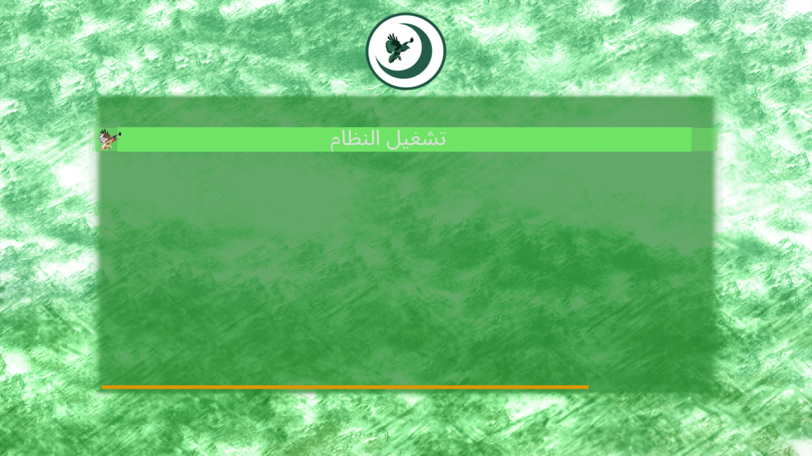

  

# ArabOS-BOOT-LOADER 🚀 محمل اقلاع نظام العرب

## عن المشروع 📝
المشروع عبارة عن محمل إقلاع مبكر (Early Bootloader) لنظم التشغيل والأنوية.

---

## بطاقة التعريف 📋

| الخاصية | التفاصيل |
| :--- | :--- |
| **اسم المشروع** | المقلع |
| **نوع المشروع** | محمل إقلاع مبكر |
| **منشئ المشروع** | سيف حسين |
| **لغة التطوير** | السي (C) |
| **إصدار المشروع** | 0.2 (مستقر) |
| **تاريخ الإصدار** | 11  الجمعة محرم 1448 هـ \| 26 يونيو 2026 م |
| **رخصة المشروع** | GPL-2.0 / رخصة المطورين العرب العمومية-ARDB-1.0 |

---

📄 ترخيص المشروع (Project Licensing)هذا المشروع متاح بموجب ترخيص مزدوج (Dual-Licensing) لضمان أقصى درجات التوافق والمرونة للمطورين. يحق لك كمستخدِم أو مطوّر اختيار التعامل مع هذا المشروع بموجب أحد الخيارين التاليين:الخيار الأول: شروط رخصة المطورين العرب العمومية (ARDB-1.0) - انظر ملف 0.1-LICENSE-ARDB.الخيار الثاني: شروط رخصة جنو العمومية (GNU GPLv2) - انظر ملف LICENSE-GPL-2.0.يمكنك اختيار الرخصة التي تناسب طبيعة مشروعك والقيود القانونية الخاصة به عند دمج أو إعادة توزيع هذا الكود.

## إخلاء المسؤولية ⚠️
> **تنبيه:** لا يزال الإصدار الحالي تجريبياً وفي مراحله الأولى. لا يتحمل المطور أي مسؤولية عن أي سوء استخدام أو أي أضرار ناتجة عن تشغيل البرمجية على الأجهزة. استعمله على مسؤوليتك الخاصة (يُفضل تجربته على بيئات وهمية مثل QEMU أو VirtualBox).
